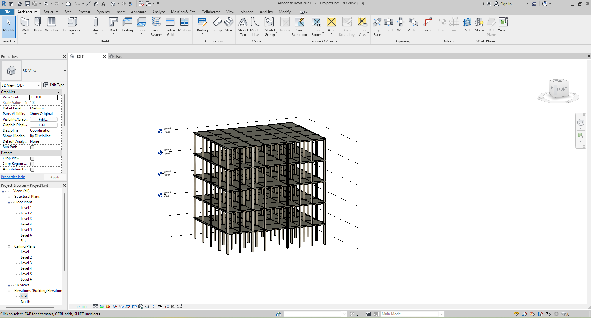
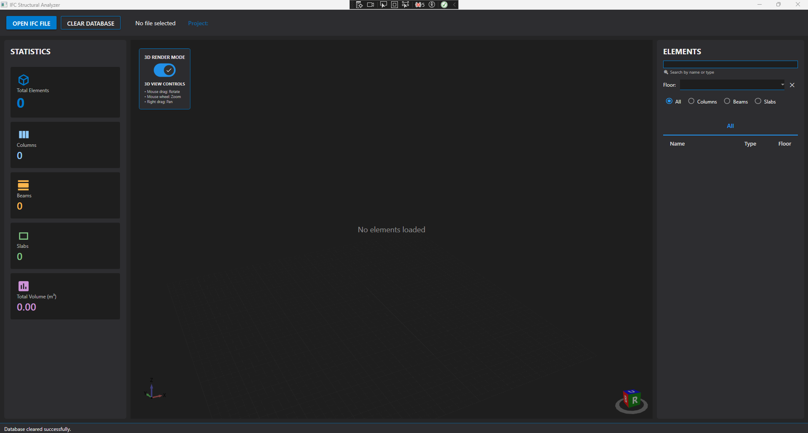
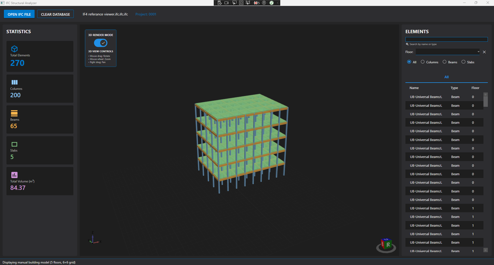

# 🏗️ IFC Structural Analyzer

**A modern WPF application for parsing IFC files and visualizing structural elements in 3D**


> **Automatically extract structural elements (columns, beams, slabs) from IFC files and visualize them in an interactive 3D environment with real-time rendering.**

---

## 🎯 What Problem Does This Solve?

As a structural engineer or BIM coordinator, you often need to:
- ✅ Quickly validate structural elements in BIM models before analysis
- ✅ Extract only structural data from complex architectural IFC files
- ✅ Visualize structural systems without opening heavy BIM software
- ✅ Prepare data for import into structural analysis software

**This application does all of that in seconds.**

---
## 📸 Screenshots Explained

### Screenshot 1: Original Revit Model


Shows the source BIM model in Autodesk Revit
Contains architectural and structural elements
This is the model that will be exported as IFC

### Screenshot 2: Empty Application Interface


Modern WPF interface with empty 3D viewport
"Load IFC File" button ready for user interaction
Status bar showing application ready state

### Screenshot 3: Loaded IFC Model with Color-Coded Elements


- 🔵 Blue = Columns
- 🟠 Orange = Beams
- 🟢 Green = Slabs
  
Interactive 3D navigation enabled
Element count displayed in status bar
Demonstrates successful IFC parsing and visualization

## ✨ Key Features

### 🔍 IFC Processing
- **Multi-Version Support**: IFC4 and IFC2x3 TC1 compliant
- **Smart Parsing**: Extracts columns, beams, and slabs with full geometry
- **Fast Loading**: Optimized for files up to 500MB
- **Coordinate System Handling**: Automatic normalization of global coordinates

### 🎨 3D Visualization
- **Real-Time Rendering**: Built with HelixToolkit.Wpf
- **Interactive Controls**: 
  - Mouse drag to rotate
  - Scroll to zoom
  - Right-click drag to pan
- **Color-Coded Elements**: Instant visual identification by type
- **Isometric View**: Professional engineering perspective

### 🏛️ Clean Architecture
- **Separation of Concerns**: Domain → Application → Infrastructure → Presentation
- **Dependency Injection**: Microsoft.Extensions.DependencyInjection
- **MVVM Pattern**: CommunityToolkit.Mvvm for ViewModels
- **Repository Pattern**: Abstracted data access with EF Core
- **Testable Design**: Interface-based architecture

---

## 🛠️ Technology Stack
```
Framework:        .NET 8.0 + C# 12.0
UI:               WPF + Material Design
IFC Processing:   xBIM Essentials (Xbim.Ifc4, Xbim.Geometry)
3D Rendering:     HelixToolkit.Wpf 2.25.0
Database:         Entity Framework Core + SQL Server
Architecture:     Clean Architecture + MVVM
DI Container:     Microsoft.Extensions.Hosting
```

---

## 📁 Solution Structure
```
IFCStructuralAnalyzer/
│
├── Domain/                                                            # Core business entities
│   ├── Entities/
│   │   ├── StructuralElement.cs                                       # Base class
│   │   ├── StructuralColumn.cs
│   │   ├── StructuralBeam.cs
│   │   ├── StructuralSlab.cs
│   │   └── Material.cs
│   │
│   └── ValueObjects/
│       └── Dimension.cs                                               # Volume calculations
│
├── Application/                                                       # Business logic layer
│   ├── Abstractions/
│   │   └── Repositories/
│   │       └── Interfaces/
│   │           ├── IGenericRepository.cs
│   │           ├── IStructuralElementRepository.cs
│   │           └── IMaterialRepository.cs
│   │
│   ├── Services/
│   │   ├── Interfaces/
│   │   │   ├── IIFCParserService.cs
│   │   │   ├── IGeometryConversionService.cs
│   │   │   ├── IStructuralElementService.cs
│   │   │   └── IMaterialService.cs
│   │   │
│   │   └── Concrete/
│   │       ├── IFCParserService.cs                                    # IFC → DTO mapping
│   │       ├── GeometryConversionService.cs                           # Coordinate extraction
│   │       ├── StructuralElementService.cs                            # CRUD operations
│   │       └── MaterialService.cs
│   │
│   ├── DTOs/
│   │   ├── StructuralElementDto.cs
│   │   ├── IFCModelDto.cs
│   │   ├── MaterialDto.cs
│   │   └── StatisticsDto.cs
│   │
│   └── Mapping/
│       └── AutoMapperProfile.cs                                       # Entity ↔ DTO mapping
│
├── Infrastructure/                                                    # Data access layer
│   ├── Data/
│   │   ├── Context/
│   │   │   └── IFCAnalyzerDbContext.cs                                # EF Core DbContext
│   │   │
│   │   └── Configurations/
│   │       ├── StructuralElementConfiguration.cs
│   │       └── MaterialConfiguration.cs
│   │
│   ├── Repositories/
│   │   └── Concrete/
│   │       ├── GenericRepository.cs
│   │       ├── StructuralElementRepository.cs
│   │       └── MaterialRepository.cs
│   │
│   └── Migrations/                                                 # EF Core migrations
│
└── Presentation/                                                   # UI layer
    ├── ViewModels/ 
    │   └── MainViewModel.cs                                        # MVVM + RelayCommand
    │
    ├── Views/
    │   ├── MainWindow.xaml                                        # Material Design UI
    │   └── MainWindow.xaml.cs
    │
    ├── Services/
    │   └── Rendering3DService.cs                                  # 3D mesh generation
    │
    └── Converters/
        └── StringComparisonConverter.cs                           # XAML value converters

```

---

## 📊 Supported IFC Elements

| IFC Type | Rendered As | Extraction Method |
|----------|-------------|-------------------|
| `IfcColumn` | 🔵 Blue box | `IIfcColumn` → Width × Depth × Height |
| `IfcBeam` | 🟠 Orange box | `IIfcBeam` → Length × Width × Depth |
| `IfcSlab` | 🟢 Green box | `IIfcSlab` → Area × Thickness |

**IFC Standards Compliance:**
- ✅ IFC4 (ISO 16739:2018)
- ✅ IFC2x3 TC1 (ISO 16739:2005)

**Geometry Extraction:**
- Placement coordinates from `IIfcObjectPlacement`
- Dimensions from `IIfcExtrudedAreaSolid`
- Material layers from `IIfcMaterialLayerSetUsage`

---

## 💡 Real-World Use Cases

### 1. **Pre-Analysis Validation**
Before importing to ETABS/SAP2000/Robot:
- Verify all structural elements are correctly classified
- Check geometry consistency
- Identify missing or misplaced elements

### 2. **Fast Model Review**
- Open a 200MB IFC file in seconds (vs. 2 minutes in Revit)
- Focus only on structural elements
- Share lightweight visualizations with team

### 3. **BIM Coordination**
- Cross-check structural model against architectural model
- Identify clashes between disciplines
- Verify floor-by-floor element distribution

### 4. **Educational Tool**
- Understand IFC file structure
- Learn structural element classification
- Study BIM data organization

---

## 🔧 Technical Deep Dive

### IFC Parsing Flow
```csharp
// 1. Open IFC file
using var model = IfcStore.Open(filePath);

// 2. Extract columns
foreach (var ifcColumn in model.Instances.OfType())
{
    var location = GetRealWorldLocation(ifcColumn);  // Extract coordinates
    var dimensions = ExtractDimensions(ifcColumn);   // Extract W×D×H
    var floorLevel = GetFloorLevel(ifcColumn);       // Find storey
    
    // Create DTO
    var columnDto = new StructuralElementDto
    {
        Name = ifcColumn.Name,
        GlobalId = ifcColumn.GlobalId,
        ElementType = "Column",
        LocationX = location.X,
        LocationY = location.Y,
        LocationZ = location.Z,
        Width = dimensions.Width,
        Depth = dimensions.Depth,
        Height = dimensions.Height,
        FloorLevel = floorLevel
    };
}

// 3. Save to database via EF Core
await _elementService.ImportElementsAsync(elementDtos);
```

### 3D Rendering Pipeline
```csharp
// 1. Normalize coordinates (IFC uses global coordinates)
var modelCenter = CalculateModelCenter(elements);

foreach (var element in elements)
{
    // Convert mm → meters and normalize
    double x = (element.LocationX / 1000.0) - modelCenter.X;
    double y = (element.LocationY / 1000.0) - modelCenter.Y;
    double z = (element.LocationZ / 1000.0) - modelCenter.Z;
    
    // Create mesh
    var meshBuilder = new MeshBuilder();
    meshBuilder.AddBox(
        new Point3D(x, y, z + height/2), 
        width, depth, height
    );
    
    // Apply material
    var material = new DiffuseMaterial(GetColorForType(element.Type));
    
    var model3D = new GeometryModel3D
    {
        Geometry = meshBuilder.ToMesh(),
        Material = material
    };
}
```

### Database Schema (EF Core)
```sql
-- TPH (Table Per Hierarchy) strategy
CREATE TABLE StructuralElements
(
    Id INT PRIMARY KEY IDENTITY,
    GlobalId NVARCHAR(50) NOT NULL,
    Name NVARCHAR(200) NOT NULL,
    ElementType NVARCHAR(21) NOT NULL, -- 'Column', 'Beam', 'Slab'
    
    -- Location (meters)
    LocationX FLOAT(18) NOT NULL,
    LocationY FLOAT(18) NOT NULL,
    LocationZ FLOAT(18) NOT NULL,
    
    -- Dimensions (mm)
    Width FLOAT(18) NOT NULL,
    Depth FLOAT(18) NOT NULL,
    Height FLOAT(18) NOT NULL,
    
    -- Type-specific fields (nullable)
    Length FLOAT NULL,      -- For beams
    Area FLOAT NULL,        -- For slabs
    Thickness FLOAT NULL,   -- For slabs
    
    -- Metadata
    FloorLevel INT NOT NULL,
    MaterialId INT NULL,
    ImportDate DATETIME2 NOT NULL,
    
    CONSTRAINT FK_Materials FOREIGN KEY (MaterialId) 
        REFERENCES Materials(Id) ON DELETE SET NULL
);

CREATE INDEX IX_GlobalId ON StructuralElements(GlobalId);
CREATE INDEX IX_FloorLevel ON StructuralElements(FloorLevel);
```

---

## 🎓 What I Learned Building This

### Technical Skills
- **IFC Standards**: Deep understanding of BuildingSMART specifications
- **3D Graphics**: Mesh generation, camera systems, coordinate transformations
- **Clean Architecture**: Proper layer separation and dependency management
- **EF Core**: Migrations, TPH inheritance, complex queries
- **xBIM Toolkit**: Geometry extraction, property sets, spatial structures

### Engineering Insights
- Different BIM tools export IFC differently (Revit vs ArchiCAD)
- Coordinate systems in IFC are project-origin based (not (0,0,0))
- Geometry representation varies (ExtrudedAreaSolid, BRep, CSG)
- Material data is often incomplete in exported IFC files

### Challenges Solved
| Challenge | Solution |
|-----------|----------|
| Large file performance | Async loading + progress reporting |
| Global coordinates (450000mm+) | Automatic center normalization |
| Missing geometry data | Fallback to default dimensions |
| Duplicate GlobalIds | GUID regeneration on import |

---

## 👨‍💻 About the Developer

**Merve Kıratlı**  
*Architecture Graduate → Software Developer*

- 🎓 TOBB ETÜ Architecture (2021)
- 🏗️ 4 years in architectural practice (BIM specialist)
- 🏆 2nd Place - İTÜ Design Together with BIM 2020
- 💻 Full-time software development since March 2024
- 🎯 Passion: AEC technology, BIM automation, structural software

### Why This Project Exists

During my years as an architect, I spent countless hours:
- Manually transferring data from Revit to structural analysis software
- Validating IFC exports before sending to engineers
- Opening huge BIM models just to check structural elements

**This tool solves those pain points through automation.**

It demonstrates:
- ✅ Domain expertise in AEC/BIM workflows
- ✅ Production-ready code architecture
- ✅ Ability to work with complex file formats (IFC)
- ✅ 3D visualization for engineering applications

**Perfect for companies developing CAD/BIM/structural analysis software.**

---

## 📫 Connect

- **LinkedIn**: [Merve Kıratlı](https://www.linkedin.com/in/merve-kiratli-0b049a187)
- **GitHub**: [@mrvekratl](https://github.com/mrvekratl)
- **Email**: mrvekratl@gmail.com
- **Portfolio**: [More AEC Software Projects →](https://github.com/mrvekratl?tab=repositories)

---

## 🙏 Acknowledgments

- **BuildingSMART International** - IFC standard maintainers
- **xBIM Team** - Excellent open-source IFC toolkit
- **HelixToolkit Contributors** - Powerful 3D rendering library
- **Material Design Team** - Beautiful UI components

---

## ⭐ Show Your Support

If this project helped you understand IFC parsing or Clean Architecture:
- ⭐ Star this repository
- 🔗 Share with BIM professionals
- 📧 Reach out for collaboration

---

**Built with ❤️ by an architect who codes**

*Making BIM workflows more efficient, one tool at a time.*
